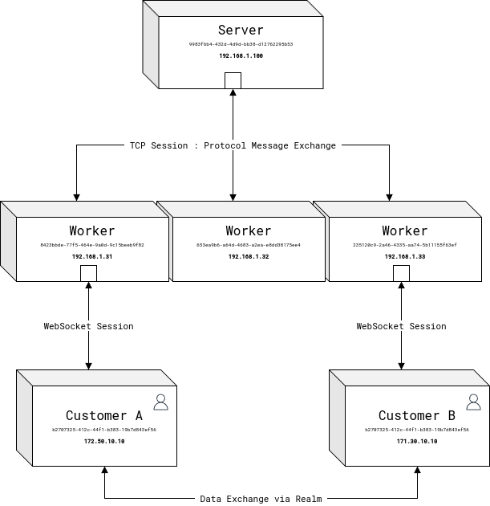

<h1 align="center">Copper</h1>

    

    

<h2 align="center">About</h2>

**Copper** is a **high performance, scalable and distributed data exchange system**.

    

## About the Protocol

You could see how protocol works on the related [documentation](Protocol.md).

## About License

The software as well as code, is released to the public domain a no explicit license, excepting only the third party dependencies and code which is released in his respective licenses. The rights of this creation, including the idea, possibility of commercial usage, schemas, concepts and documents, scoped to this project, are protected by national and international law and the right of usage is allowed and limited only to the creator and can't be used by other people, companies or governments entities, including third parties without an explicit, and real license, scoped, limited, signed in paper and included by the author in the source code, even by a minimal violation or disrespect, including the denial as well as unauthorized private and public or commercial usage or inspiration with no respect of the previous license and terms will produce international sanctions and will raise goods seizures in different space times in benefit to the creator of this software.

Ian Torres &copy; All rights reserved 2024
